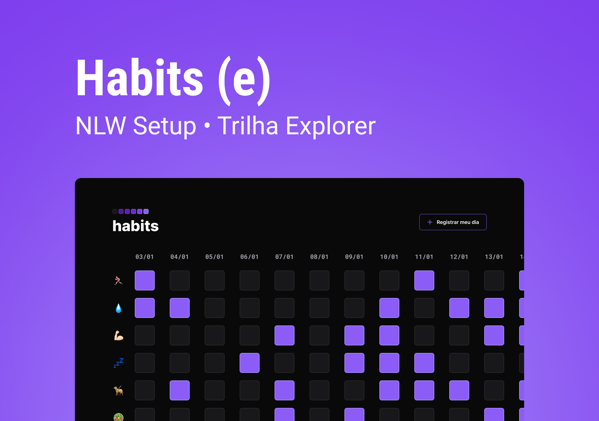

<h1 align='center'> Habits </h1>

 NLW is a free and exlusive course offered by Rockeseat for WEB technologies teaching. 

  <a href='#technologies'> Technologies </a> | 
  <a href='#project'> Project</a> |
  <a href='#layout'> Layout</a> |
  <a href='#contact'> Contact</a>

 

## 💻 Technologies

 - HTML & CSS
 - JavaScript
 - Git & GitHub
 - Figma

## 📁 Project

Project Habits serves as activity recorder in order to help the user register his goals during the days of the week.

## ✂️ Layout

You can access and experiment the project through this [link](https://victoralva08.github.io/nlw-setup/). 

## 📞 Contact
victor.falva08@gmail.com

